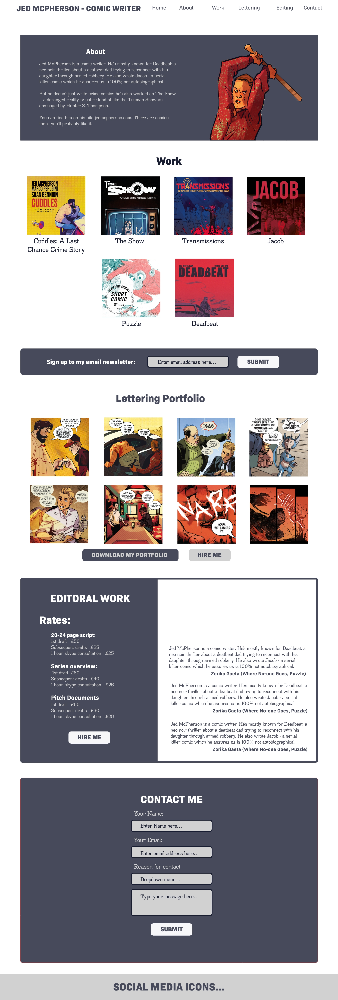

# **Jed McPherson - Comic Writer**

Jed McPherson - Comic Writer is a personal website for the comic book writer Jed McPherson. The site is targeted towards fans of the writer’s work, new readers, and potential collaborators, or employers. Jed McPherson - Comic Writer will act as an online portfolio, providing examples of the writer's work, links to purchase the books, and information on how to hire the writer for your project. 

This project is the first milestone project for the Code Institute Diploma in Full Stack Software Development. You can see the final deployed site [here.](https://john-mcpherson.github.io/HTML-and-CSS-Esseentials-Portfolio-Project/)

## **Contents**
* [UX](#ux)
    * [User Stories](#user-stories)
    * [Design](#design)
    * [Wireframes](#wireframes)
* [Features](#features)
    * [Nav Bar](#nav-bar) 
    * [About Me](#about-me)
    * [Work](#work)
    * [Newsletter Sign-up](#newsletter-sign-up)
    * [Lettering Portfolio](#lettering-portfolio)
    * [Editorial Work](#editorial-work)
    * [Contact Form](#contact-form)
    * [Footer](#footer)
    * [Writing Portfolio](#writing-portfolio)
* [Features left to implement](features-left-to-implement)
    * [Upcoming Appearances](#upcoming-appearances)
    * [Update Navbar](#update-navbar)
* [Technologies Used](technologies-used)
* [Testing](#testing)
* [Deployment](#deployment)
* [Credits](#credits)
    * [Content](#content)
    * [Media](#media)
    * [Acknowledgements](#acknowledgements)

## **UX**
The site is a portfolio site for my comics writing, lettering, and editorial work. It has to be able to serve both readers/ fans and potential collaborators. 

### **User stories**

#### As a reader, I expect:
* To be able to easily find out information about the writers work and where to buy their books. 
* To be able to follow the creator on social networks. 

#### As a reader, I want:
* To be able to read samples of work in order to make an informed decision before purchasing. 
* To have the option to stay up to date with future releases. 
* To be able to easily navigate around the website in an easy to understand manner. 

#### As a potential collaborator, I expect:
* To be able to see examples of the quality of the creator’s work. 
* To easily be able to get in contact with the writer to further discuss any collaborations. 

#### As a potential collaborator, I want:
* To have a breakdown of services offered and prices. 
Testimonials from previous collaborators and contact information for follow up questions.  

### **Design**

The Site is designed with a scrolling home page with content split up into clearly defined sections (Work, Lettering, Editorial, and Contact). As the site has two target audiences (readers and potential collaborators) material that is relevant to both target audiences will be placed towards the top of the page.   

The work section has a cover gallery that links to a separate page for each book. That way if readers want more information it is easily accessible without cluttering the main page. 

The fonts for the project are Bio-Sans for the headings and Madawaska for the body text. Both fonts were taken from Adobe Fonts. 

The colour palette was generated by uploading the cover of Cuddles: A Last Chance Crime story to [PaletteGenerator.com]( https://palettegenerator.com) to generate an initial colour palette which was then refined using [coolors](coolors.co). 

I used muted colours so as to not distract from the art work and book covers. 

### **Wireframes**
Before starting on the project, I created a mock up using Adobe Xd.  
#### **Desktop**

#### **Mobile**

## **Features**

### **Nav Bar**
 * Featured on all the pages. This will allow the user to easily navigate around the site. 
 * Because the site makes use of a scrolling layout the navigation bar will be fixed at the top of the page allowing the user to always have easy access to the navigation features. 
* On smaller devices the nav bar will be replaced with a hamburger menu giving allowing users to still access navigation features while maintaining a sleek design. 

### **About Me**
* A short autobiography section introducing the writer and their work. This will serve as an introduction to the writer both for potential collaborators and readers. 
* Accompanied by an eye-catching image taken from mu work. 

### **Work** 
* A cover gallery of each of the writer’s books. 
* Each image should be a clickable link leading to new page with sample pages, collaborator info, links to buy the books, and a short blurb. 
* This will be updated as more books are released. 

### **Newsletter Sign-up** 
* A short form allowing users to enter their information to sign-up for a monthly newsletter. 

### **Lettering Portfolio**
* Another gallery. This time including examples of my lettering work. 
* Accompanied by a button that links to the contact form allowing potential employers to easily contact me.  
* A button that links to a more detailed lettering portfolio PDF. This will open in a new tab. 
* This section will be updated as more work is completed. 

### **Editorial**
* A breakdown of the various editorial services available including rates. Allowing potential clients to make an informed decision. 
* Testimonials from previous clients. Including links to their finished work where available.  
* A link to the contact form. 

### **Contact Form**
* A short form allowing users to contact me. This will include the users name, a contact email address, and a reason for contact. This will allow the writer to easily sort correspondence from fans from potential job opportunities. 

### **Footer**
* A small section with links to my various social media accounts including Twitter, Instagram, and Facebook. 
* This will be included at the bottom of all pages to maintain a visual consistency across all pages. 
* The links will open in a separate tab to prevent users from accidentally navigating away from the site. 

### **Writing Portfolio**
* Each of my books will have their own page. These will include sample art work pages, a brief synopsis/ blurb of the content, and where appropriate links to purchase the content. 
* Any external links will open in a separate tab to prevent users from accidently navigating away from the site. 

## **Features left to implement**

### **Upcoming Appearances**
* Due to the current Covid 19 pandemic I am attending very few conventions and as a result having a calendar with upcoming appearances was very low priority. As more events open back up this will move up in priority. 
### **Update Navbar**
* Change the nav bar to make use of JavaScript rather than CSS hacks on smaller screens. 

## **Testing**

[Link to External testing document](./TESTING.md)

## **Technologies Used**

### **Languages** 

* HTML5
* CSS3

## **Deployment**

The site is deployed via github pages. To deploy the site:

1. Go to the Github repository for the project.
2. Click on the settings menu at the top right-hand side of the page. 
3. Scroll down and select the pages tab towards the bottom of the menu. 
4. Select the source branch that you want to publish. 
5. Click save. This will generate a url for the site.  

## **Credits**

### **Content**

All code was written by me with the following exceptions; 

* Used the html code and CSS for social media icons and adapted from the [Code Institute Love Running Code Along project.](https://github.com/Code-Institute-Solutions/Love-Running-Solutions) 

* Used the CSS style for styling for placeholder text from [CSStricks.com](https://css-tricks.com/almanac/selectors/p/placeholder/)

* Used the CSS code for smooth scrolling from Kevin Powell’s [YouTube page](https://www.youtube.com/watch?v=jBhuPKnsBCE) 

* Adapted the code for the responsive nav bar from Kevin Powell’s [YouTube video]( https://www.youtube.com/watch?v=8QKOaTYvYUA&t=2344s) on responsive navigation bars. 

### **Media**

The images used on all pages are taken from my comics work and I retain copyright to all images with the exception of the work for hire images used in the lettering section. These are taken from work for hire work I have completed for TPub comics and have been used with their express permission.

The social media icons in the footer and the download icon in the lettering section was taken from [Font Awesome]( https://fontawesome.com). 

All fonts used in the project were taken from [Adobe Fonts](https://fonts.adobe.com/?ref=tk.com) and were licenced through my creative cloud subscription. 

### **Acknowledgements** 

* My mentor [Antonija Simic](https://github.com/tonkec) for their feedback and support during the development of the project. 
* [Code Institute](https://codeinstitute.net/) for giving me the skills through their tutorials to create this site. 
* [Kevin Powell’s YouTube channel](https://www.youtube.com/channel/UCJZv4d5rbIKd4QHMPkcABCw) was incredibly useful in understanding more complex elements of CSS and HTML. In particular his video series on flexbox was very helpful in helping me to understand how to use display flex to layout pages.
* [Free Code Camp](https://www.freecodecamp.org/) for introducing me to coding. 
* [Css-tricks.com](https://css-tricks.com/) and [W3Schools](https://www.w3schools.com/) for helping me whenever I got stuck. 

