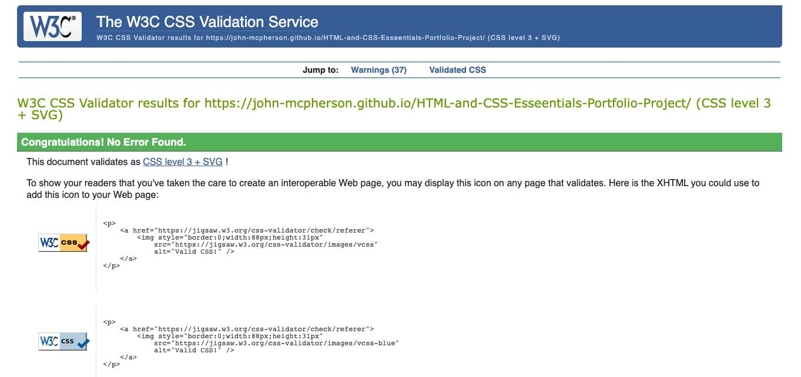
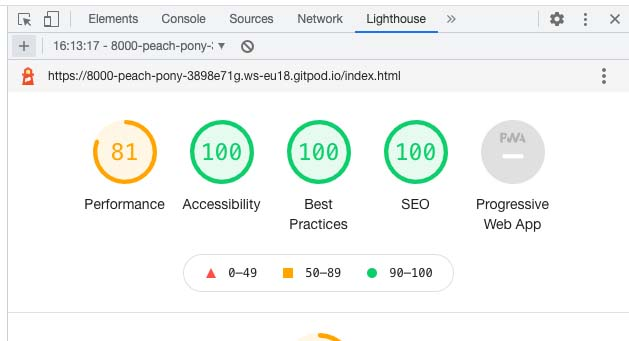
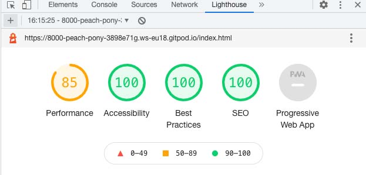

# **Testing** 

## **Functionality Testing**

My first checks were to test the usablity of my website. I manually checked all internal links to see if they worked as intended. I also checked all extrenal links to make sure that they were linked to the correct place and that they opened in a seperate tab. 

I then checked the forms to make sure that they worked correctly. Both forms worked as expexted and would not let you submit without the correct infomation. 

## **Code Validation**

I ran the html code through the W3C html validatior to make sure that there weren't any issues with the code. It flagged up some issues that were corrected in commits x and x. I then ran it throught the vaildator again and it passed. 

I then ran the code through the the W3C CSS validation service and it passed.

## **Prefomance**

### Lighthouse

Lighthouse in chrome developer tools was used to assess the preformance of the page. The top image shows the desktop preformance of the home page, while the bottom image shows it's mobile preformance. I also checked all other pages and they got the same, if not a better, score. 

## **User Story Evaluations**

#### As a reader, I expect:
* To be able to easily find out information about the writers work and where to buy their books.

**After the about me section there is a image gallery with the cover of each of my books. These have clickable links that take the user a product landing page where there are infomation on where to buy the books as well as links to where they are available to buy online.** 

* To be able to follow the creator on social networks. 

**The footer displays on all pages and has easy to navigate links to all my social media accounts.** 

#### As a reader, I want:
* To be able to read samples of work in order to make an informed decision before purchasing. 

**Each book has a section on the page where the reader can sample the first four pages. It also has a short description of the content to help the reader make an informed desicion.** 
* To have the option to stay up to date with future releases. 

**There is a sign up from for my email newsletter displayed under the work section that readers can use to stay upto date with my work.** 
* To be able to easily navigate around the website in an easy to understand manner. 

**The nav bar allows users to easily navigate through the page and it scrolls with the page so it is always accessable. There are also internal links in the lettering and editoral sctions that allow the user to quickly navigate to the contact page.**

#### As a potential collaborator, I expect:
* To be able to see examples of the quality of the creator’s work. 

**There are examples of my writing on the writing portfolio pages and there is lettering examples for potential collaborators to inspect. Also there is an external link that allows them to download a more detailed lettering portfolio.** 
* To easily be able to get in contact with the writer to further discuss any collaborations. 

**There is a contact form on the page that allows collaborators to contact me. Also, there are internal links on both the editoral section and the lettering section that directs potential creators to the contact form.**

#### As a potential collaborator, I want:
* To have a breakdown of services offered and prices. 

**The editroal section has a breakdown of services with prices.** 
* Testimonials from previous collaborators and contact information for follow up questions.  

**Next to the editoral section there is a testimonial section with clickable links to the creators prefered social media or their website.** 
